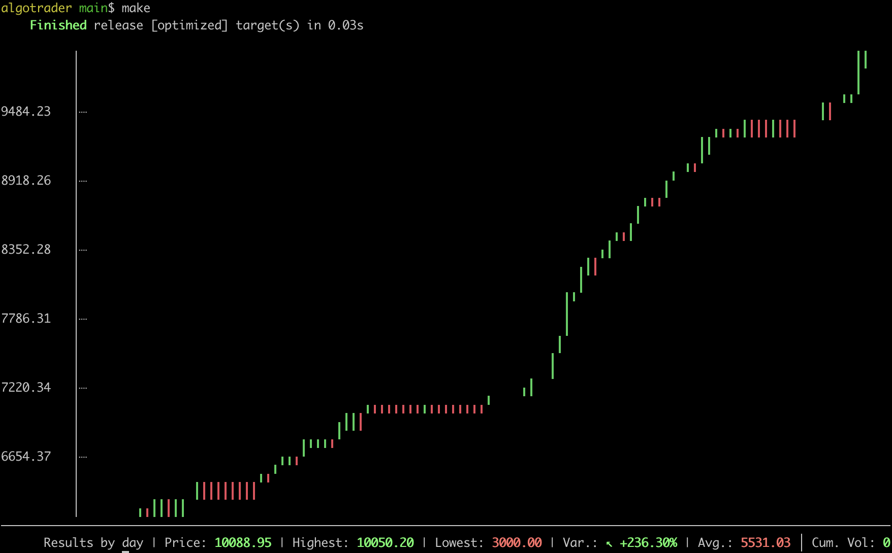

# algotrader

WIP: Work in progress.

## Intro

Open source algorithmic trader with fast backtesting written in [Rust](https://www.rust-lang.org/).

## What works so far

- Running `make` shows backtest results.
- Running `make test` runs tests.



You can support the development of this tool (give me more time to work on it) by using [my referal link to ig.com](https://refer.ig.com/joakimk-16) or send bitcoin to `1TqbToWRV41o8879d8zNectrVHz5H97zV`.

## Goal 1: Proof of concept (backtest, two strategies, hardcoded config)

Step 1

- [x] TradingView import for stock data.
- [ ] Be able to run on 1 stock.
  - [x] Be able to run one stock without considering days.
  - [x] Separating into days and running days in parallel.
  - [ ] Simulator (src/simulator.rs)
    - [x] Rework parallelism to be about variations and fuzz rather than days
    - [x] Rework so that current account size is always available and fees applied to next day
    - [x] Review all todos in the code
    - [x] One simple strategy.
      - [x] Basic buy and sell structure
      - [x] Make trades based on the strategy
    - [x] Don't provide full current day data in backtests (e.g. high/low/close since that is future knowledge that won't be available in real trading).
    - [x] Figure out why the previous day bug produced so much better results (it knew the future)
    - [x] Rework data so that the strategies can't access any future data accidentally.
    - [x] Implement moving averages
    - [ ] Implement stop loss helpers
    - [ ] Select a market and implement strategy that works on a short time frame
    - [ ] Display trades and manually verify they makes sense in reality.
  - [ ] Run with live data
    - [ ] Live data API
    - [ ] Run with live data.
    - [ ] Manual buy and sell notifications as default fallback API.

Step 2

- [ ] Implement buy and sell APIs to let it run for real (with tiny sums of money).
  - The idea here is to fix the most common error states as they occur over time.

Step 3

- [ ] Be able to run on multiple stocks
- [ ] Two different stategies (probably one for ranging and one for trending markets).

Bonus

- Full system testing setup (once I have explored what data the system will return, etc.)

## Goal 2: Use the data to implement proper backtesting tools and initial strategies

- [ ] More backtesting tools, fuzzing, optimization, etc.
- [ ] Implement and verify different strategies.

## Core concepts and design ideas

- [ ] Loss is always a possible outcome.
  - Never trade anything you can't loose. Even if everything works correctly, perhaps a technical issue somewhere causes orders not to go through properly, or something happens where the market gaps up or down unexpectedly during the day. This is why you want to risk a fixed amount and not the entire account.
- [ ] Fixed amount positions by default.
  - This will make an account grow slower but safer since it avoids huge losses if you start going exponential in the wrong direction.

- [ ] Backtests
  - [ ] Backtests are essential.
    - Only trade what has been proven to work historically.
  - [ ] Backtests should be nearly instant.
    - You should not feel like skipping backtesting because it's slow, or have to iterate slowly when developing algorithms.
  - [ ] Backtests are two step verification.
    - Only use all available data for final verification to avoid tailoring algorithms to the specific historic data.
  - [ ] Backtests fuzz.
    - By changing initial conditions (like date) it can reveal if a strategy only works when run on a specific day.
- [ ] Day trading
   - The market might be a bit more unreliable on lower timeframes, but at the same time it allows you to work with many different timescales down to seconds.
   - Gives faster feedback on what works and what does not since trades play out over the day instead of days or weeks.
   - Allows for parallel backtesting of multiple days at the same time.
   - Avoids issues with holding positions over multiple days like fees, gap up/down, leverage rebaseing (using say 10x leverage, the underlying market goes down 5% the first day and then up 5% the next, you loose 50% the first day and then gain 50% the next means you now have 75% of the original amount, e.g. `1000 * 0.5 * 1.5 = 750`), ...
   - Using max loss per day by default since some days just don't behave like you expect, better to just wait for the next one.

- [ ] Strategies
  - [ ] No magic values in strategies, everything is configurable.
    - This allows different settings per market and changing settings over time.
    - This also allows for automatically figuring out the best config (possibly by brute force testing).
  - [ ] Many strategies can be active at the same time looking at the same or different markets. There can be many concurrent trades but it's limited to 1 by default.
  - [ ] Ideally it should be able to select strategies and settings based on the recent market conditions, or just what works best in backtests recently.

- [ ] Testing
  - This will be tested (as in automated tests) in a way that allows for a lot of flexibility of implementation. I'm biasing this towards full system tests, e.g. given this config and this data, assert which trades where executed.
  - Unit tests will be used where it makes a lot of sense like for calculations like moving average, ATR, etc.

## Various notes

- [ ] Properties to show in result
  - [ ] Maximum drawdown
  - [ ] Exposure time by strategy
    - [ ] Adjusted result given it would be exposed 100% of the time.

## Development

Test data in this project is from [TradingView](https://www.tradingview.com/) but you could use any data that provides timestamp/open/close/high/low and volume.

If you want to export data from TradingView you will need to have a paid account. I have confirmed with TradingView support that it is okay to include data from their exports in a public project like this.

Import data.

```
make import
```

Run backtests and show results.

```
make
```

Run tests

```
make test
```

## Contributions

Contributions are very welcome, but be aware I don't always have a lot of spare time for this project so it could take some time before I can review it. The more well made, consistent with the style of the existing project, and well tested it is the easier it is to include it.

## Broker integration ideas

- The simplest possible API would be one that provides market data during the day and then notifies you to buy or sell when needed. You probably want to run such an integration on the hourly timeframe to not get too many notifications.

## Unfinished broker integrations

- [Fix API](https://help.ctrader.com/fix/#advanced-trading-robots) seems very intresting since it can work with many brokers and seems to be free (?) to use on for example skilling when using c-trader. That also has the benefit of very small spreads and almost no fees.
- [Nordnet](https://github.com/joakimk/algotrader-nordnet)

## Related resources

- https://www.youtube.com/c/CriticalTrading

## Various backtest inspiration

- Review what is the most essential data to show with results based on The output shown here https://youtu.be/tbronjDYeUs?t=594

## Various algorithm inspiration

- https://youtu.be/4k1_1cLoMKk?t=198
- https://www.youtube.com/watch?v=_9Bmxylp63Y 
- https://www.youtube.com/watch?v=qMXUMjckVhU&ab_channel=TheTransparentTrader
